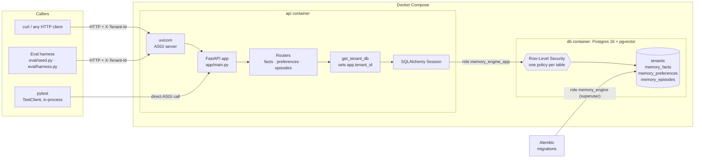
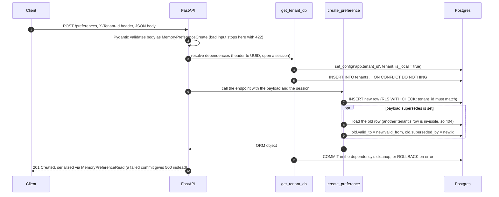
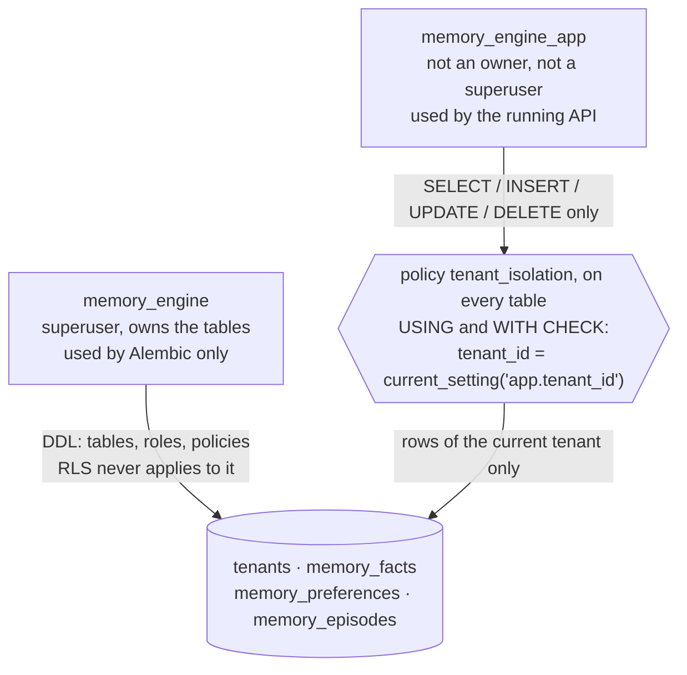
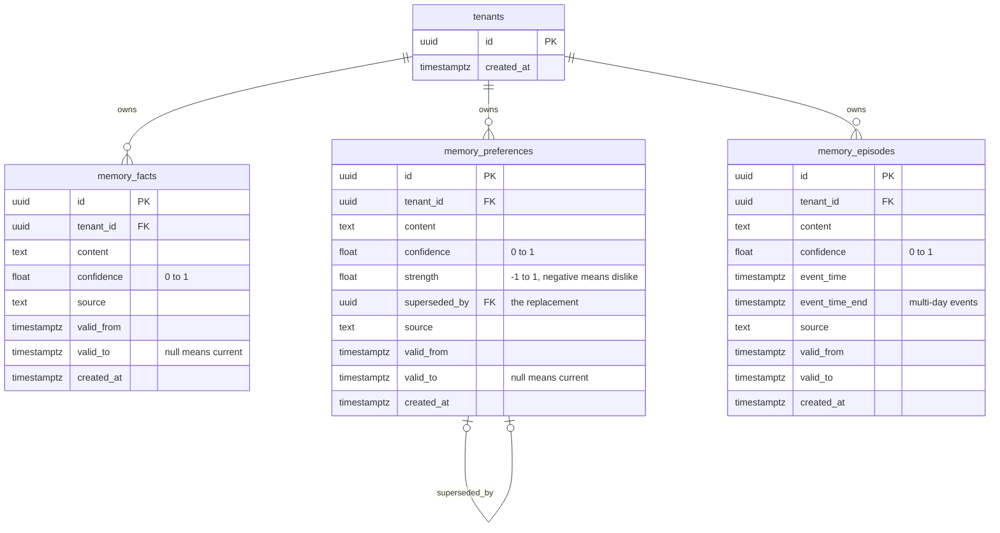
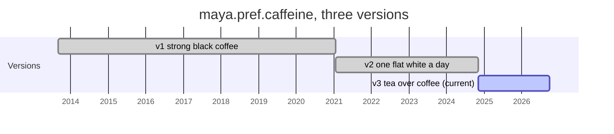
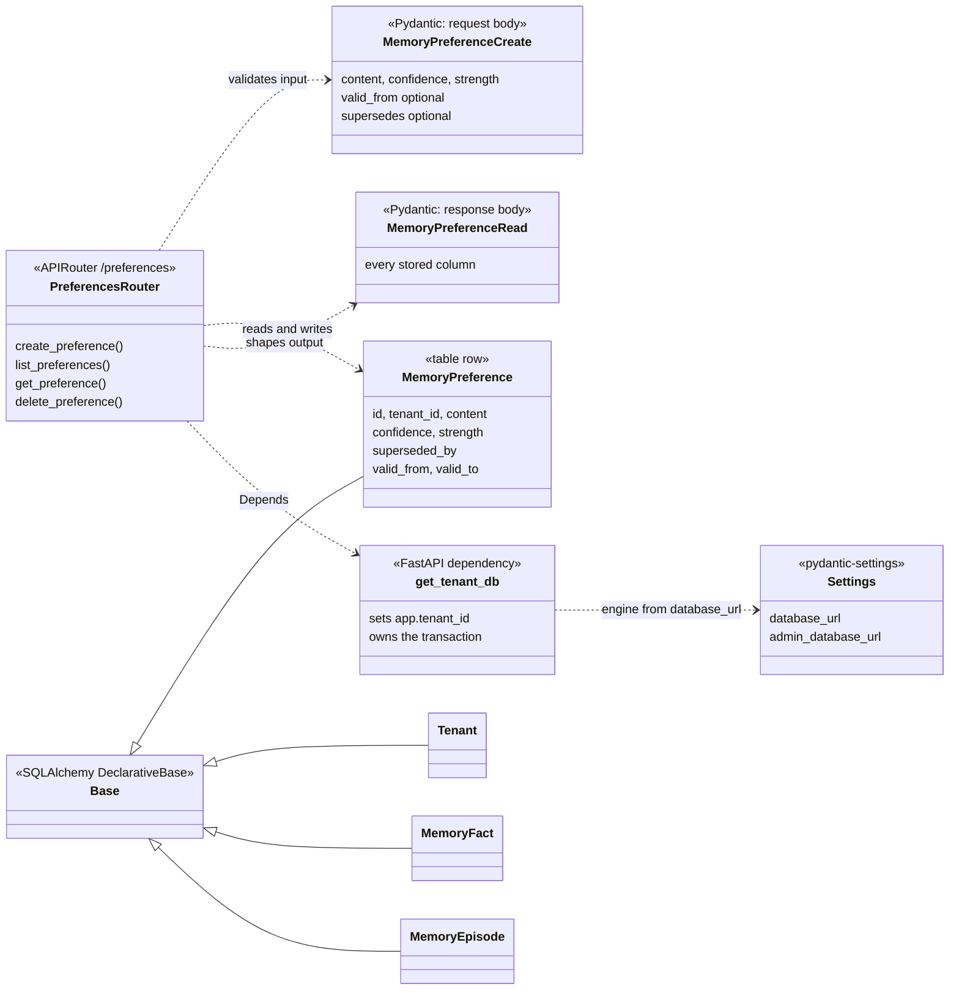
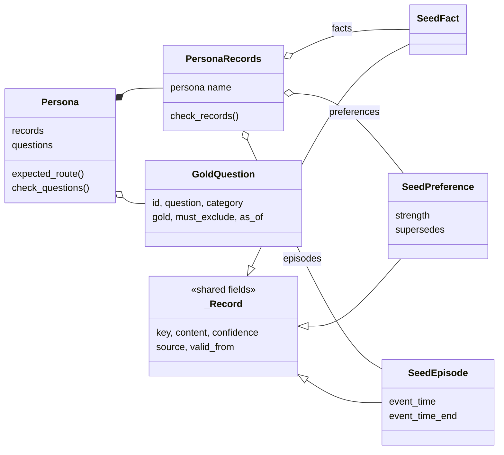
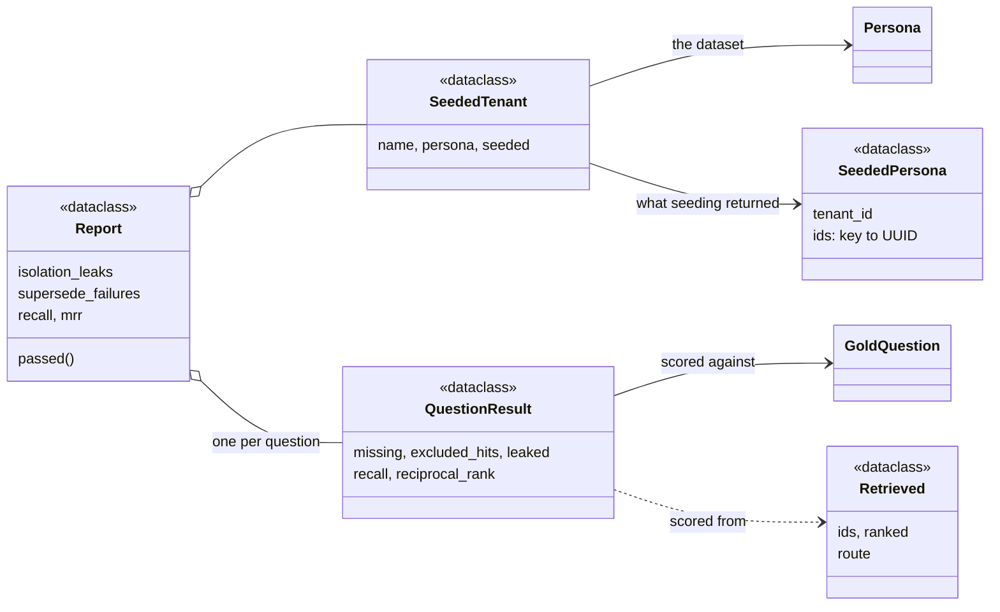
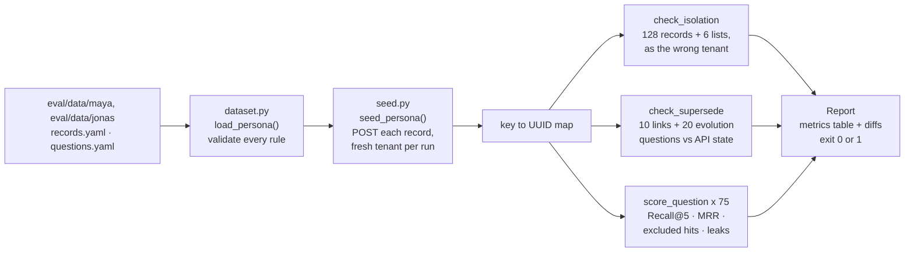
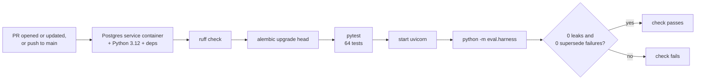

# Mutable

An AI personal assistant that reliably tracks how a user's mind changes, not just what it currently knows.

## Why

Preferences change over time, and a memory system needs to handle that without losing history or confusing old state with current state. Every fact, preference, and episode here is typed and temporally-versioned: preferences are versioned, not overwritten, so when one changes, the old record is closed out and explicitly linked to its replacement. There's always exactly one current answer, and the full history stays queryable on request. The eval harness scores this directly, not just generic retrieval quality: a "current preference" question must exclude a superseded record, and a historical question must still retrieve the old one correctly.

Multi-tenant and isolated from day one, via Postgres Row-Level Security enforced as a database invariant rather than an application-level filter.

**The direction:** this is the memory layer for a full AI personal assistant — one that can eventually act on a user's behalf (milestone 12) through whatever interface fits (milestone 10) — grounded in a record of who someone is that's actually kept up to date, not guesswork. It's a useful, standalone API on its own either way.

**Status:** milestone 3 (eval dataset + harness) done — a 100-record persona with 75 gold questions, plus an isolation-only second tenant, seeded through the API and scored by a harness that runs on every PR. It reports zero cross-tenant leaks and correct supersede handling on all 20 preference-evolution questions; Recall/MRR read 0.00 until search lands in milestone 4. See the [Roadmap](#roadmap).

## Getting started

```bash
cp .env.example .env
docker compose up -d db
docker compose run --rm api alembic upgrade head
docker compose up
```

- `curl localhost:8000/health` — liveness
- `curl localhost:8000/health/db` — confirms the API can reach Postgres
- `curl -X POST localhost:8000/facts -H "X-Tenant-Id: <any-uuid>" -H "Content-Type: application/json" -d '{"content": "...", "confidence": 0.9}'` — every resource endpoint requires this header; a tenant is created implicitly the first time its id is used, no signup step

Tests: `docker compose run --rm api pytest`. Lint: `docker compose run --rm api ruff check .`

Eval (with the API running): `docker compose run --rm api python -m eval.harness --base-url http://api:8000` — seeds both personas as fresh tenants and prints the metrics table. Add `--require-retrieval` to also fail on the Recall/MRR bars. The dataset lives in `eval/data/`, its design in [`eval/personas.md`](eval/personas.md).

## Memory types

- **Facts** — durable assertions ("lives in London"). Point lookup + embedding search on one current value.
- **Preferences** — versioned opinions ("prefers tea to coffee"). Latest-valid-wins: a query sees the current value unless it explicitly asks historically.
- **Episodes** — timestamped events ("interviewed at X, 2026-03-04"). Many can coexist for the same topic; retrieval is recency/range-weighted, not latest-wins.

No Documents type — long-form text needs chunking, a different retrieval problem. No Policies type — behavior rules are an agent concern, not something retrieved to answer a question; representable as a Preference if ever needed.

## Architecture

**Multi-tenant from the schema up.** Every table carries `tenant_id`, enforced by Postgres Row-Level Security — not an app-level `WHERE` clause. RLS makes isolation a database-enforced invariant instead of a discipline every query has to remember; one missed filter in application code is a silent data leak.

**Three typed tables**, not one polymorphic table with a JSONB payload. `memory_facts`, `memory_preferences`, `memory_episodes` share a common shape (`id`, `tenant_id`, `content`, `confidence`, `valid_from`, `valid_to`, `created_at`, `source`, plus `embedding` from milestone 4) and add type-specific columns. Typed tables keep constraints and indexes real; JSONB would hide the structure that makes the types meaningfully different.

**Temporal validity, not overwrite.** `valid_from`/`valid_to` versions every row; a superseded preference points `superseded_by` at its replacement. A memory system that overwrites in place can't answer "what did I used to believe."

**Retrieval routes before it searches.** A rule-based classifier reads the question (date expressions → episodes, "prefer/like/hate" → preferences, else facts) and produces type + time hints. Search then runs hybrid (pgvector + full-text) per hinted table, always inside the tenant's RLS boundary, and results merge by similarity + recency + confidence. An LLM-based router is a natural v2 — deferred because it adds latency, cost, and non-determinism to every query; the eval harness can A/B it against this baseline later.

**Confidence is caller-supplied**, not inferred — there's one source per fact until an extraction pipeline exists. Ingestion is structured JSON only, no free-text extraction, so writes stay deterministic and auditable.

## Eval contract

Two synthetic tenants, no real user data in the repo. Tenant A carries the full seed set (100 records, 75 labeled questions) for retrieval quality. Tenant B is a minimal second tenant that exists only to probe isolation.

| Metric | Bar |
|---|---|
| Recall@5 / MRR | ≥ 0.9 / ≥ 0.8 on Tenant A |
| Cross-tenant leaks | 0, always — pass/fail, not a threshold |
| Routing accuracy | scored independently of retrieval quality |
| p95 latency | tracked from the caching milestone on |

The harness runs both suites against a live API and prints a metrics table with per-question failure diffs. It runs on every PR and fails it on any leak or supersede error — not an afterthought. Recall/MRR join the gate once search exists (milestone 4).

## How it all fits together (milestones 1–3)

A guided tour of what exists today — the tools, the classes, and the reasoning behind each choice. Everything here is built and tested; anything planned is marked with its milestone.

**In one paragraph:** Mutable is a FastAPI service in front of Postgres. Callers send JSON over HTTP with an `X-Tenant-Id` header; Pydantic validates it; SQLAlchemy turns it into rows in one of three typed tables. Postgres itself — not the Python code — guarantees one tenant can never see another's rows, using Row-Level Security. Preferences are never overwritten: a change closes the old row and links it to the new one, so history stays queryable. An eval harness seeds a fictional user through the API and checks all of this on every pull request.

### The big picture



Two paths reach the database, deliberately with different rights: **the API** connects as a restricted role that RLS always applies to; **Alembic** connects as the owner/superuser because it needs to create tables, roles, and policies — and never serves a request.

### The toolbox: what each piece does here, and why

| Tool | Its job in this repo | Why this one | Alternatives, and why not (yet) |
|---|---|---|---|
| **Python 3.12** | Everything | Mature typing (`X \| None`, `Self`), the ecosystem for AI work later | — |
| **FastAPI** | HTTP layer: routing, request parsing, dependency injection (`Depends`), auto-generated docs at `/docs` | Validation comes free from type hints via Pydantic; `Depends` is how tenant scoping is attached to every request | **Flask**: no built-in validation or DI. **Django**: its ORM and admin are heavier than an API-only service needs |
| **uvicorn** | The server process that runs the FastAPI app | Standard ASGI server for FastAPI; `--reload` for dev | Gunicorn with uvicorn workers — a deploy-time concern (milestone 6) |
| **Pydantic** | Three jobs: API request/response shapes (`app/schemas.py`), config from env vars (`pydantic-settings`), validating hand-written eval YAML (`eval/dataset.py`) | One way to say "this data must look like this" everywhere, with clear errors | marshmallow; hand-rolled checks. **SQLModel** would merge Pydantic and SQLAlchemy classes — kept separate so the API contract and the table layout can differ (e.g. `supersedes` is input-only) |
| **SQLAlchemy 2.0** | ORM: Python classes ↔ tables (`app/models.py`), sessions, transactions | Typed `Mapped[...]` models; Alembic reads them to generate migrations | Raw SQL via psycopg: more control, but every query hand-written and no autogenerate |
| **psycopg 3** | The Postgres driver SQLAlchemy talks through | Current-generation driver | psycopg2 (older), asyncpg (async-only) |
| **PostgreSQL 16** | Storage, constraints, **Row-Level Security** | RLS makes isolation a database guarantee; CHECK constraints guard value ranges | A separate vector DB (Pinecone, Qdrant) would need its own, second isolation mechanism |
| **pgvector** | Extension enabled since migration `0001`; no vector column yet | Embeddings (milestone 4) live in the same rows, under the same RLS | See above |
| **Alembic** | Versioned schema migrations (`migrations/versions/`) | Creates tables *and* things an ORM can't express: roles, grants, RLS policies | `Base.metadata.create_all()`: no history, no upgrades, no roles/policies |
| **Docker + Compose** | `db` (pgvector image, healthcheck, persistent volume) and `api` (built from `Dockerfile`, code mounted for live reload) | Same Postgres + pgvector for everyone, one command to start; milestone 6 deploys this same file | Local installs — "works on my machine" drift |
| **pytest + TestClient** | 64 tests calling the app in-process against the **real** Postgres | Tests exercise the real RLS and constraints | SQLite or mocks would be faster but have no RLS or pgvector — they'd test a different system |
| **httpx** | HTTP client for the eval seed loader and harness | Same client type as `TestClient`, so one function works for tests *and* the live API | requests (no shared interface with TestClient) |
| **PyYAML** | Reads the eval dataset files | Hand-authored data needs comments and little punctuation | JSON (no comments); Python literals (data buried in code) |
| **Ruff** | Lint + formatting | One fast tool replacing flake8/isort/black | Those three separately |
| **GitHub Actions** | CI on every PR and push to `main` | Lives next to the code; free for this scale | Any CI would do |

### What happens during one request

Following `POST /preferences` that replaces an older preference — the most involved write in the system:



Three details make tenant scoping hold:

- **`set_config(..., is_local = true)`** scopes the tenant to *this transaction only*. Pooled connections get reused across requests; a session-wide setting would leak one request's tenant into the next.
- **The tenant row is inserted implicitly** on first use — no signup. Safe because `tenants` has an RLS policy too: a caller can only ever insert *their own* id.
- **One transaction per request**, committed at the very end — but *before* the response is sent (`TENANT_DB` uses FastAPI's `scope="function"`), so a failed commit can never be reported as a success. Committing earlier would end the transaction and with it the tenant setting, before the endpoint's own queries ran.

### Isolation: two roles and one policy



`USING` filters what a query can *see*; `WITH CHECK` blocks *writing* a row for another tenant. If `app.tenant_id` was never set, the policy raises an error instead of quietly matching nothing.

| Isolation approach | How it works | Why not chosen |
|---|---|---|
| **Postgres RLS** ✅ | The database filters every row by the transaction's tenant | — (cost: every connection must set the tenant, which `get_tenant_db` does) |
| `WHERE tenant_id = ...` in Python | Every query remembers to filter | One forgotten filter is a silent data leak |
| Schema per tenant | Each tenant gets its own copy of the tables | Migrations multiply by tenant count; cross-tenant ops get awkward |
| Database per tenant | Strongest separation | Heavy to operate for many small tenants |

It's proven twice: `tests/test_isolation.py` connects to Postgres *directly* as the API's role and shows each tenant sees only its own rows; the eval harness probes all 128 seeded records as the wrong tenant on every PR.

### The data model



**How a preference changes.** Nothing is overwritten. The old row is closed exactly where the new one starts, so at any moment exactly one version is valid. Here is Maya's caffeine preference as stored in the eval dataset:



"What does she drink now?" → the row with `valid_to = null`. "What did she drink in 2022?" → the row whose window contains 2022. Callers may backdate `valid_from` so real history can be recorded; a replacement dated before the row it replaces is rejected.

| Data-model decision | Chosen | Alternative | Trade-off accepted |
|---|---|---|---|
| Table layout | Three typed tables | One table with a JSONB payload | A little repetition across tables, in exchange for real constraints and columns per type |
| Change history | `valid_from`/`valid_to` + `superseded_by` | Overwrite in place; separate audit-log table | Queries must filter `valid_to IS NULL` for "current" |
| Which types version | Preferences only | Versioning for facts too | A changed fact is written in the past tense ("worked at Studio Loop 2019–2024") until facts get supersede |
| Confidence | Supplied by the caller | Inferred by the system | Nothing to infer from until free-text extraction (milestone 8) |

### How the Python classes work together

**The API (`app/`).** Every memory type has the same four-part shape; preferences are shown, facts and episodes mirror it:



Why two kinds of class per type: the **SQLAlchemy model** is what a row *is*; the **Pydantic schemas** are what callers may *send* and will *get back*. They differ on purpose — a caller can't send an `id` or `tenant_id`, and `supersedes` is an instruction, not a column. `MemoryPreferenceRead` builds itself straight from the ORM object (`from_attributes`).

**The eval (`eval/`), part 1 — what the YAML becomes** (`dataset.py`). Every class here inherits from a small `_Strict` base that makes Pydantic reject unknown fields, so a typo in the YAML fails loudly instead of being silently dropped:



**Part 2 — what a run produces** (`seed.py`, `harness.py`):



The dividing line: **Pydantic** classes guard data coming *in* from hand-written YAML (typos and bad labels fail loudly); **dataclasses** carry data the code itself produced (seeding results, scores), which needs no validation.

### The eval pipeline



| Eval decision | Chosen | Alternative | Why |
|---|---|---|---|
| Data source | Two fictional personas, hand-written | Real data; LLM-generated data | No real personal data in the repo; hand-written gold labels are trustworthy |
| How records get in | Through the public API | Direct SQL inserts | Exercises the same validation, supersede logic, and RLS a real caller hits |
| Record identity | Stable keys (`maya.pref.diet.v2`) | UUIDs in the files | UUIDs are assigned by the server; keys are readable and stable |
| Re-runs | A new tenant every run | Wiping the database | Nothing to clean up; runs can't interfere with each other |
| What retrieval sees | Only the question text | The gold labels | A search that could peek at the answers would score meaninglessly |
| The second persona | Different content, **same topics** as Maya's questions | Unrelated topics | A leaked record can only show up in results if it would actually rank |

### CI: what runs on every pull request



The harness report is also written to the run's summary page, readable from the PR's Checks tab. Recall/MRR are printed but don't fail the check until search exists (milestone 4 turns on `--require-retrieval`).

### Where things live

| Path | What's in it |
|---|---|
| `app/main.py` | Creates the FastAPI app, mounts the routers, `/health`, `/health/db`, `/whoami` |
| `app/config.py` | `Settings`: the two database URLs, read from env vars or `.env` |
| `app/db.py` | Engine, session factory, and the `get_tenant_id` / `get_tenant_db` dependencies |
| `app/models.py` | SQLAlchemy models — the tables |
| `app/schemas.py` | Pydantic models — the API's request and response shapes |
| `app/routers/` | One file per memory type: create, list current, get by id, delete |
| `migrations/versions/` | Seven migrations, in order: pgvector → tenants → facts → preferences → episodes → app role → RLS |
| `tests/` | API tests per type, the direct-Postgres isolation test, dataset/seed/harness tests |
| `eval/personas.md` | Design doc for the two fictional users |
| `eval/data/` | The dataset: records and gold questions per persona |
| `eval/dataset.py` · `seed.py` · `harness.py` | Validate → seed → score |
| `Dockerfile` · `docker-compose.yml` | The two containers |
| `.github/workflows/ci.yml` | The CI pipeline above |

### Known gaps (honest list)

- **No authentication yet.** The API trusts whatever `X-Tenant-Id` it's given, so anyone who knows or guesses a tenant id can act as that tenant. RLS guarantees tenants can't see *each other* — not that a caller is who they claim. Real auth is milestone 7.
- **Deletes are hard deletes,** which sits awkwardly with "never lose history". Deleting a preference that an older version points to is refused (`409`) so chains can't break, but there's no soft-delete or undo yet.
- **Facts can't be superseded** — only preferences version (see the data model table).
- **No search yet.** pgvector is installed but unused; embeddings, hybrid search, and the router are milestone 4.
- **Sync endpoints.** Routes are plain `def`, so FastAPI runs them in a thread pool. Simple and fine at this scale; async SQLAlchemy is an option if load ever demands it.

## Roadmap

Each milestone ships something runnable and checkable on its own — none depends on a later one to be demoable.

### 1. Scaffold
**Ships:** Docker Compose running Postgres with pgvector enabled, a migration tool wired up, CI running lint and tests on every push.
**Done when:** `docker compose up` gives a working local Postgres+pgvector; an empty migration and empty test suite both go green in CI.

### 2. Schema + tenant-scoped ingestion
**Ships:** the three typed tables (`memory_facts`, `memory_preferences`, `memory_episodes`) with `tenant_id` and RLS policies from the first migration, plus a CRUD API per type with versioning on write.
**Done when:** two tenants are seeded through the API, and a direct Postgres session for one tenant provably cannot read the other's rows.

### 3. Eval dataset & harness v1
**Ships:** synthetic seed data for two tenants — Tenant A (~100 records across facts/preferences/episodes, ~75 hand-labeled questions with gold record IDs) and Tenant B (~20–30 records, isolation probes only) — seeded through milestone 2's API; a CLI harness that runs both suites against the live API and prints a metrics table with per-question failure diffs. The gold question set gives first-class coverage to preference evolution specifically, the product's core differentiator: a "current preference" question must exclude a superseded record, and a historical question must still retrieve the old one correctly.
**Done when:** the harness runs end-to-end and reports zero cross-tenant leaks (proving milestone 2's RLS in practice) and correct supersede handling on every preference-evolution question, even though overall Recall/MRR are near-zero, since there's no search yet, only CRUD, and retrieval metrics are expected to fail until milestone 4 makes them pass.

### 4. Search + routing
**Ships:** the embedding write path, hybrid (vector + full-text) search per type, the rule-based query router — wired into the same harness from milestone 3.
**Done when:** re-running that harness now shows Recall@5 ≥ 0.9 / MRR ≥ 0.8 on Tenant A, with isolation still at zero leaks.

### 5. Caching
**Ships:** a Redis-backed embedding cache and hot-query cache, keyed per tenant.
**Done when:** the eval harness shows a measured p95 latency drop with identical Recall/MRR/isolation results — proof the cache is invisible to correctness.

### 6. Deploy + CI/CD
**Ships:** the same `docker-compose.yml` from milestone 1, deployed to a single AWS EC2 instance (not ECS/RDS — cheapest option, and the closest match to local dev, at the cost of self-managed Postgres backups instead of RDS's); CI/CD running the full eval harness (isolation gate included) as a required check before deploy.
**Done when:** there's a live endpoint on a public IP/DNS name, and a PR that breaks tenant scoping gets blocked by a red eval run before it can merge.

### 7. Accounts & billing
**Ships:** real signup/login replacing the caller-supplied opaque tenant ID, API-key issuance, basic plan gating.
**Done when:** a new tenant signs up through a real auth flow and gets a scoped key that RLS enforces exactly as it does today.

### 8. Free-text ingestion
**Ships:** an endpoint that accepts raw text and calls an LLM to extract structured facts/preferences/episodes into the existing schema.
**Done when:** pasting an unstructured paragraph produces the same typed, versioned rows a structured POST would, with extraction confidence populated and reviewable before commit.

### 9. Answer synthesis (RAG)
**Ships:** an optional endpoint that takes retrieved records and generates a prose answer via an LLM, on top of (not instead of) the existing retrieval endpoint.
**Done when:** a question returns a synthesized answer that cites the specific record IDs it drew from.

### 10. Client layer
**Ships:** a thin UI or chat interface consuming the existing API — the first real product surface on top of the engine.
**Done when:** someone who isn't you can add and query memories without touching curl or Postman.

### 11. Document/vault ingestion
**Ships:** chunked ingestion for long-form text, likely a new memory type with its own retrieval strategy.
**Done when:** a full document can be ingested and a question against it returns the right chunk, evaluated against its own gold set.

### 12. Autonomous agent behavior
**Ships:** a policy layer letting an agent act on stored memory (schedule, notify, decide), not just retrieve it.
**Done when:** an agent takes a real action informed by a memory lookup, with an audit trail of which memory drove which action.
